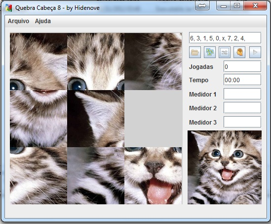

puzzle8
=======

Jogo criado para a materia de Inteligência Articial da Universidade de Itaúna, onde a ideia era criar um jogo e resolve-lo através de algum algoritmo de inteligência articial, no caso foi utilizado o a e a*, onde foram feitas metricas para verificar qual o melhor algoritmo para tal caso. O jogo tem vários recursos como embaralhar, ou o jogador jogar sozinho com cronometro, ou os algoritmos tentarem resolver.

Este jogo foi apresentado porém não está 100%, ainda restam alguns ajustes para perfeita execução.

Foi utilizado a linguagem Java 6.

Segue um screenshot abaixo:

